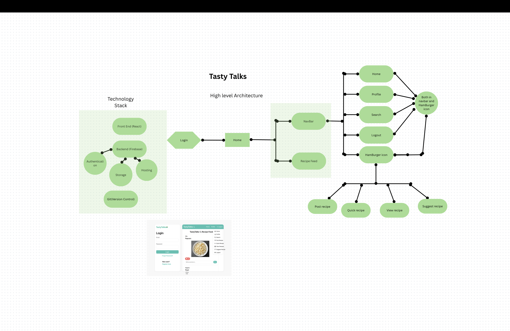

# TastyTalks 🍳

TastyTalks is a **social media platform for food lovers** to share, explore, and suggest delicious homemade recipes. It provides a simple, mobile-friendly UI with login, post, quick recipes, search, and recipe suggestion features.

---

##  Features

-  User Authentication (Firebase Email/Password)
-  Home Feed with Recipes
-  Post Recipe with Image
-  Quick Recipe (Voice-to-text integration for recipe posting)
-  AI-powered recipe suggestions
-  Like & Comment on posts
-  View Your Profile and Delete Posts
-  Search Other Users
-  View All Recipes (Search with Levenshtein logic)
-  Responsive Mobile Design

---

##  Tech Stack

| Frontend | Backend | Auth | DB | Storage | Hosting | Version Control |
|----------|---------|------|----|---------|---------|-----------------|
| React.js | Firebase Firestore | Firebase Auth | Firestore | Firebase Storage | Firebase Hosting | Git + GitHub |

---

##  High-Level Architecture

---

##  App Flow

1. User logs in using email/password
2. Lands on Home page with a global recipe feed
3. Can:
   - Add new recipe with image
   - Post quick recipe with text
   - View others’ profiles
   - Suggest recipe based on ingredients
   - Search users or recipes

---

## Setup Instructions

1. Clone the repository:

   git clone https://github.com/SaganaPK/TastyTalk.git

2. Install dependencies:

    npm install

3. Configure Firebase (add your Firebase config to firebase.js)

4. Run the project:

    npm start

<< Future Enhancements :
 

 Notifications for likes/comments

 Multi-language recipe input (with translation to English)

 Featured Chefs & Follow System

