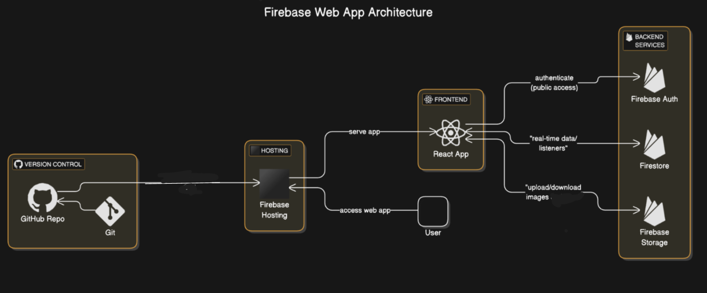

# TastyTalks 🍳

TastyTalks is a **social media platform for food lovers** to share, explore, and suggest delicious homemade recipes. It provides a simple, mobile-friendly UI with login, post, quick recipes, search, and recipe suggestion features.

---

## 🔐 Features

- 🔑 User Authentication (Firebase Email/Password)
- 🏠 Home Feed with Recipes
- 📷 Post Recipe with Image
- 📝 Quick Recipe (text-only)
- 💡 Suggest Recipes based on ingredients
- ❤️ Like & 💬 Comment on posts
- 👤 View Your Profile and Delete Posts
- 🔍 Search Other Users
- 📚 View All Recipes (Search with Levenshtein logic)
- 📱 Responsive Mobile Design

---

## ⚙️ Tech Stack

| Frontend | Backend | Auth | DB | Storage | Hosting | Version Control |
|----------|---------|------|----|---------|---------|-----------------|
| React.js | Firebase Firestore | Firebase Auth | Firestore | Firebase Storage | Firebase Hosting | Git + GitHub |

---

## 🗂️ High-Level Architecture

---

## 🧭 App Flow

1. User logs in using email/password
2. Lands on Home page with a global recipe feed
3. Can:
   - Add new recipe with image
   - Post quick recipe with text
   - View others’ profiles
   - Suggest recipe based on ingredients
   - Search users or recipes

---

## 🚀 Setup Instructions

1. Clone the repository:

   git clone https://github.com/SaganaPK/TastyTalk.git

2. Install dependencies:
    npm install

3.Configure Firebase (add your Firebase config to firebase.js)

4.Run the project:
    npm start

🌟 Future Enhancements :

🧠 AI-powered recipe suggestions

🔔 Notifications for likes/comments

📦 Voice-to-text integration for recipe posting

🌍 Multi-language recipe input (with translation to English)

🧑‍🍳 Featured Chefs & Follow System

